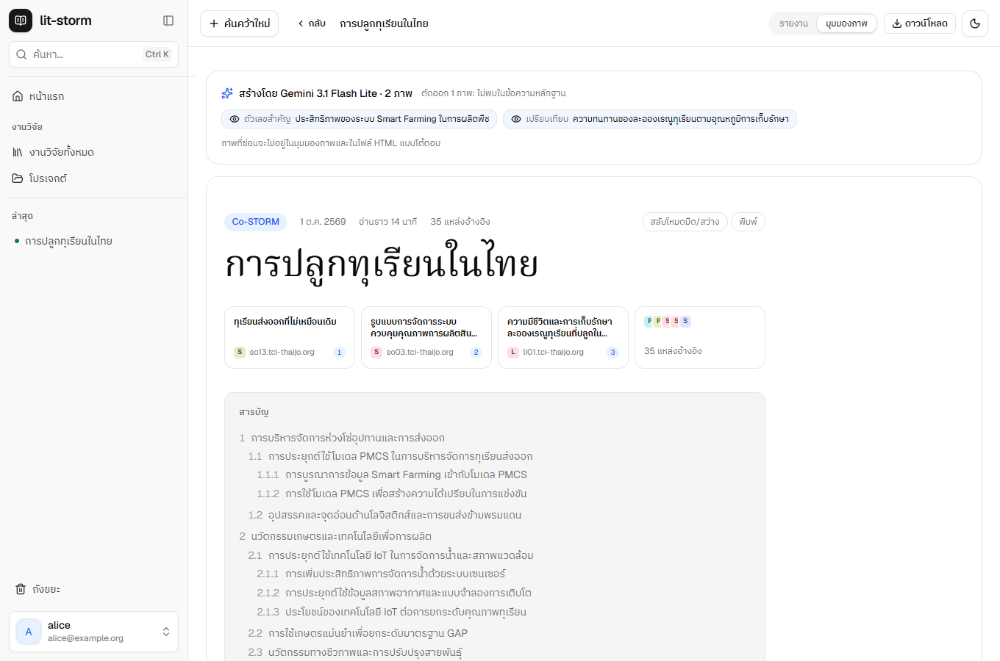
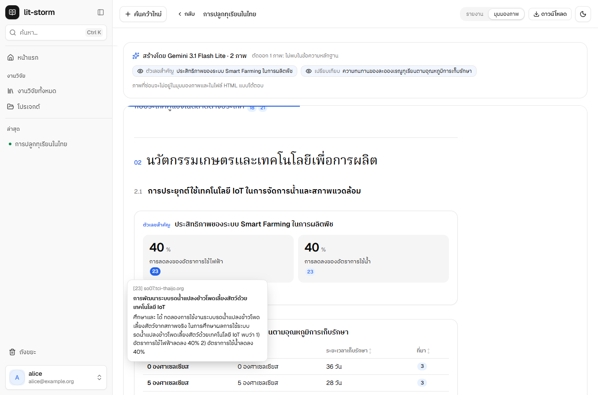
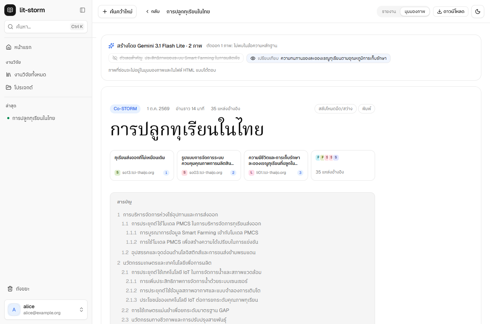
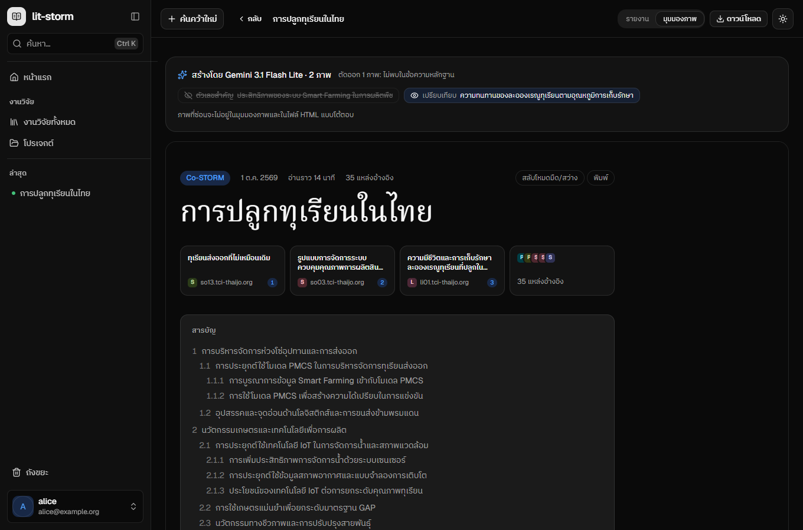
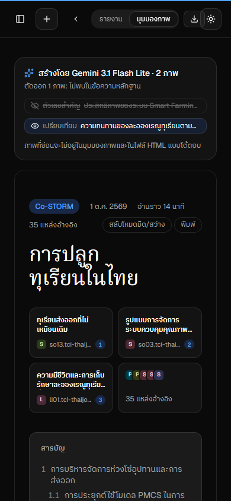

# Interactive report — acceptance

Stack `litstorm-visuals` on port 8094, installed fresh; 2026-10-01 02:42; 70s. Verdict: **PASSED**.

## A fresh stack

- ✓ migrations up to 0011 (visuals_requests)
- ✓ the Administrator's limits carry visuals_per_day (10)
- ✓ a Run finished (test Engine, no model)
- its report replaced by a real one: “การปลูกทุเรียนในไทย”, 35 sources with evidence

## Drawing, once, through the API

- ✓ before: no figures drawn
- ✓ drawn in 8.1s by Gemini 3.1 Flash Lite
- ✓ figures kept: stat_cards “ประสิทธิภาพของระบบ Smart Farming ในการผลิตพืช”, comparison “ความทนทานของละอองเรณูทุเรียนตามอุณหภูมิการเก็บรักษา”
- 1 left out by the checks
- ✓ the Run's tokens grew by 9052 (cost now unpriced)
- ✓ asked again: the kept figures, no second model call
- ✓ one request counted against Alice's daily cap
- ✓ signed out: the interactive page is refused
- ✓ download, static charts: 301 KB
- ✓ download, live charts: 1402 KB
- ✓ the page's own policy: `default-src 'none'; style-src 'unsafe-inline'; font-src data:; img-src data:; script-src '…`
- ✓ served for the app's frame with `sandbox allow-scripts allow-popups allow-popups-to-escape-sandbox`
- ✓ the other downloads still work: html (221 KB)
- ✓ the other downloads still work: pdf (303 KB)
- ✓ the other downloads still work: md (45 KB)

## In the web app

- ✓ the view is a sandboxed frame: sandbox="allow-scripts allow-popups allow-popups-to-escape-sandbox"
- ✓ 4 figures in the frame (the model's 2, the outline, the Sources cited most)
- 
- ✓ from inside the frame: the app's page blocked, its cookies blocked, the API blocked
- ✓ our script runs inside the frame
- ✓ a figure's data tab shows its table
- ✓ hovering a figure's source number shows the passage it came from
- 
- ✓ hiding “ตัวเลขสำคัญ
ประสิทธิภาพของระบบ Smart Farming ในการผลิตพืช” leaves 3 figures
- 
- ✓ the download menu offers the interactive HTML
- ✓ …and live charts as an option
- dark: 
- phone: 
